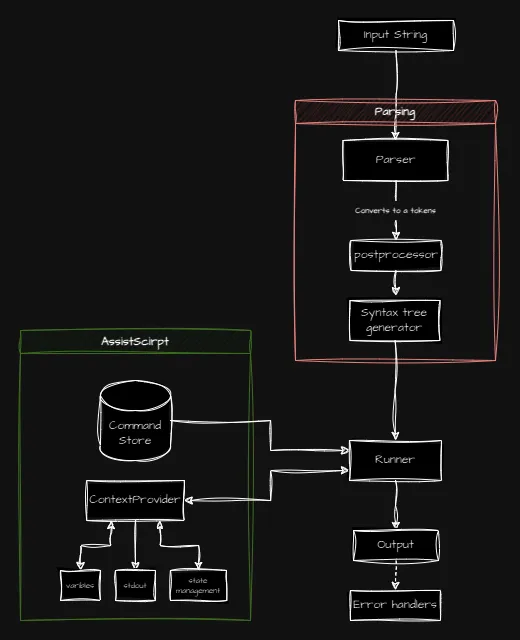
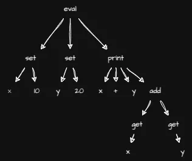
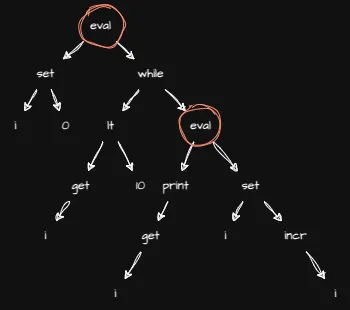

# How AssistScript parses and executes code

AssistScript is a simple language that is straightforward to parse and execute.

The basic model of the AssistScript parser and runner is shown below.<br/>

<br/>

## Parser

The input to the parser is a string of AssistScript code.
The parser reads the code and then converts it into a sequence of base tokens,
handles quotes grouping (contents inside quotes are grouped and left as it is).

Then these tokens then go through a preprocessor.
The preprocessor converts the base tokens into its corresponding token types.
That is, if the parser reads `10` then it converts 10 to `LangBaseToken`,
this is then taken by the preprocessor and converted to `NumberToken`.

This set of tokens is then passed to the syntax tree generator.
This generator creates a syntax tree from the tokens.
A recursive tree generator that takes in a set of tokens and converts them into a tree structure.
If there are subtrees, then they are combined to a greater tree.

Only one root node is returned from the tree generator.
This is a limitation, as this doesn't allow for multiple sequential commands.
And each command other than the root command must be a child of the root command.

This limitation is avoided by identifying if multiple commands are present
and then inserting a special command as the root command that takes in any number of commands,
which then later executes them sequentially.
The command used is `eval`.
To see more about this, see the [multiple commands](#multiple-commands) section.

Takes the first command token as the root and assigns the rest as children.

## Execution

The runner is a recursive tree executor that takes in the root node of the syntax tree.
Then traverses the tree recursively.
When a node visited is not a `CommandToken` then it has no child nodes
(i.e., these are the leaf nodes), and the value is returned immediately.

If the node is a `CommandToken`, then this node and rest of its children are taken as a subtree and executed.
The result of this subtree replaces the subtree as a single value.

When we want to execute a `CommandToken`, we first check if the command is present in the `CommandStore`.<br/>
- If yes, then we get the executable
  and substitute the arguments with the values of the children of the command token and execute the code<br/>
- If no, then an error is thrown.

The executable is a js function,
the first argument to the function is a reference to the `ContextProvider`.
By default, AssistScript provides a default context provider called
`BaseContextProvider` that has a few default functions.

This context provider helps the AssistScript code to interact with the outside environment. 
It allows for variable store, accessing stdout, state management, language control features, etc.

You can create your own context provider by extending the `BaseContextProvider` class.
And an instance of this new context provider can be passed to the constructor of `AssistScript`

To learn more about this, see the [creating custom context](../additionals/Create-custom-context.md) page.

---

## Example

Suppose we want to execute the following code:

```asrc
add 10 20 (sub 30 40)
```
Which is equivalent to `10 + 20 + (30 - 40) = 20`.

The parser and preprocessor will convert this code to a sequence of tokens:
```ts
[
  StringToken,
  NumberToken,
  NumberToken,
  LeftBracketToken,
  StringToken,
  NumberToken,
  NumberToken,
  RightBracketToken
]
```
Here each token has attributes like `type`, `value`, etc.

This sequence of tokens is taken and converted to a syntax tree.

The tree will look like this:
```text
    add        
    /|\        
   / | \       
  /  |  \      
10   20  sub   
          /\   
         /  \  
        /    \ 
       30    40
```

The runner will then start executing the tree from the root node.

1. The root node is a `CommandToken`, so it will execute the command `add`.
   1. Search the store for an executable with the name `add`.
   2. Get the executable and execute it with the arguments `10`, `20`, and the result of the subtree `sub 30 40`.
   3. `sub 30 40` is executed in the same way as `add 10 20`.
   4. The result of `sub 30 40` ie `-10` is substituted in place of the subtree.
2. The result ie `-20` is returned.


## Multiple commands

Take an example, where we want to execute the following code:
```asrc
(set x 10)
(set y 20)
(print x + y = (add (get x) (get y)))
```

Here we have three commands that we want to execute sequentially.
The syntax tree generator returns only a single root node.
So this cannot be directly executed.
To solve this, we insert a special command `eval` as the root command.

That is, whenever the parser identifies multiple commands,
it creates a new `eval` command node and inserts the rest of the commands as children of this node.

What `eval` does is,
it takes in any number of commands and executes them sequentially and returns the value of the last returned command.

So the above code will be converted internally to:
```asrc
eval 
  (set x 10)
  (set y 20)
  (print x + y = (add (get x) (get y)))
```

Now the root node is `eval` and the rest of the commands are children of this node.
The eval executes the children sequentially.

So it executes
- `set x 10` - sets the value of `x` to `10`
- `set y 20` - sets the value of `y` to `20`
- `print x + y = (add (get x) (get y))` - prints `x + y = 30`

The syntax tree of the above code roughly looks like;




This `eval` insertion is done internally. 
But this can be seen when and error happens and the error message will have the syntax tree that caused the error.

This is not just limited for the outer commands, the `eval` command can be inserted anywhere in the tree.

For example:
```asrc
(set i 0)
(while (lt (get i) 10) (
  (print (get i))
  (set i (incr i))
))
```

Here the syntax tree will look like:



---

This is how the AssistScript parser and runner work.

---


## Read more

- [File structure](../implementations/File-structure.md)
- [How loops are implemented](../implementations/How-loops-are-implemented.md)
- [Language documentation](../references/README.md)
- [Creating custom commands](../additionals/Create-custom-commands.md)
- [Creating custom context](../additionals/Create-custom-context.md)
